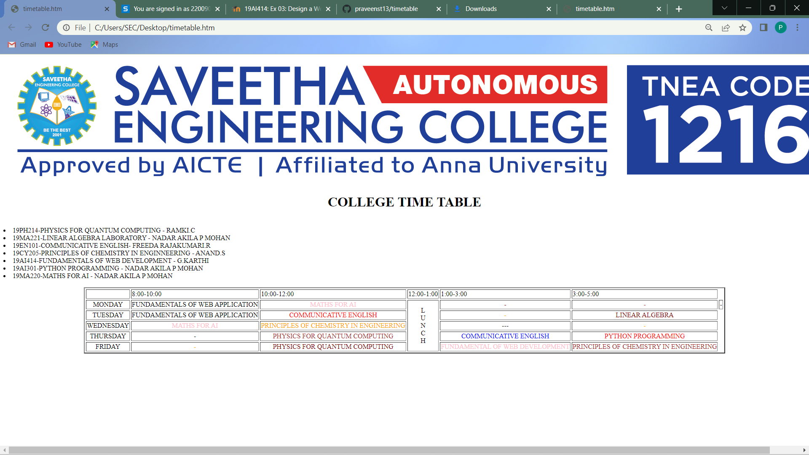

# Experiment_Time_Table

## AIM
To Write a html webpage page to display your timetable.

# ALGORITHM
### STEP 1
create a simple table using table tag
### STEP 2
Add header row using th tag
### STEP 3
Add your timetable
### STEP 4
Execute the program

# CODE
```
<!DOCTYPE html>
<html>

<body>

	


<H1><CENTER>COLLEGE TIME TABLE</FONT></H1>
<table border="2" cellspacing="3" align="center">
<tr>
 <td align="center">
 <td>8:00-10:00
 <td>10:00-12:00
 <td>12:00-1:00
 <td>1:00-3:00
 <td>3:00-5:00
</tr>
<tr>
 <td align="center">MONDAY
 <td align="center">FUNDAMENTALS OF WEB APPLICATION<font color="blue"><br>
 <td align="center"><font color="pink">MATHS FOR AI<br>
 
 <td rowspan="6"align="center">L<br>U<br>N<br>C<br>H
 <td align="center"><font color="maroon">-<br>
 <td align="center"><font color="brown">-<br>
 <td align="center">-
</tr>
<tr>
 <td align="center">TUESDAY
 <td align="center">FUNDAMENTALS OF WEB APPLICATION<font color="blue"><br>
 <td align="center"><font color="red">COMMUNICATIVE ENGLISH<br>
 <td align="center"><font color="orange">-<BR>
 <td align="center"><font color="maroon">LINEAR ALGEBRA<br>
 
</tr>
<tr>
 <td align="center">WEDNESDAY
 <td align="center"><font color="pink">MATHS FOR AI<br>
 <td align="center"><font color="orange">PRINCIPLES OF CHEMISTRY IN ENGINEERING<BR>
 <td align="center">---
 <td align="center"><font color="orange">-<BR>
 
</tr>
<tr>
 <td align="center">THURSDAY
 <td align="center">-<br>
 <td align="center"><font color="brown">PHYSICS FOR QUANTUM COMPUTING<br>
 
 <td align="center"><font color="blue">COMMUNICATIVE ENGLISH<br>
 <td align="center"><font color="red">PYTHON PROGRAMMING<br>

</tr>
<tr>
 <td align="center">FRIDAY
 <td align="center"><font color="orange">-<BR>
 <td align="center"><font color="maroon">PHYSICS FOR QUANTUM COMPUTING<br>
 <td align="center"><font color="pink">FUNDAMENTAL OF WEB DEVELOPMENT<br>
 <td align="center"><font color="brown">PRINCIPLES OF CHEMISTRY IN ENGINEERING<br>

</tr>
<br>

<u1>
<li>19PH214-PHYSICS FOR QUANTUM COMPUTING - RAMKI.C</li>
<li>19MA221-LINEAR ALGEBRA LABORATORY - NADAR AKILA P MOHAN</li>
<li>19EN101-COMMUNICATIVE ENGLISH- FREEDA RAJAKUMARI.R </li>
<li>19CY205-PRINCIPLES OF CHEMISTRY IN ENGINNEERING - ANAND.S</li>
<li>19AI414-FUNDAMENTALS OF WEB DEVELOPMENT - G.KARTHI</li>
<li>19AI301-PYTHON PROGRAMMING - NADAR AKILA P MOHAN</li>
<li>19MA220-MATHS FOR AI - NADAR AKILA P MOHAN</li>
</u1>
<br>
</body>
</html>

```

# OUPUT

# RESULT
Thus the program is executed for displaying the timetable
